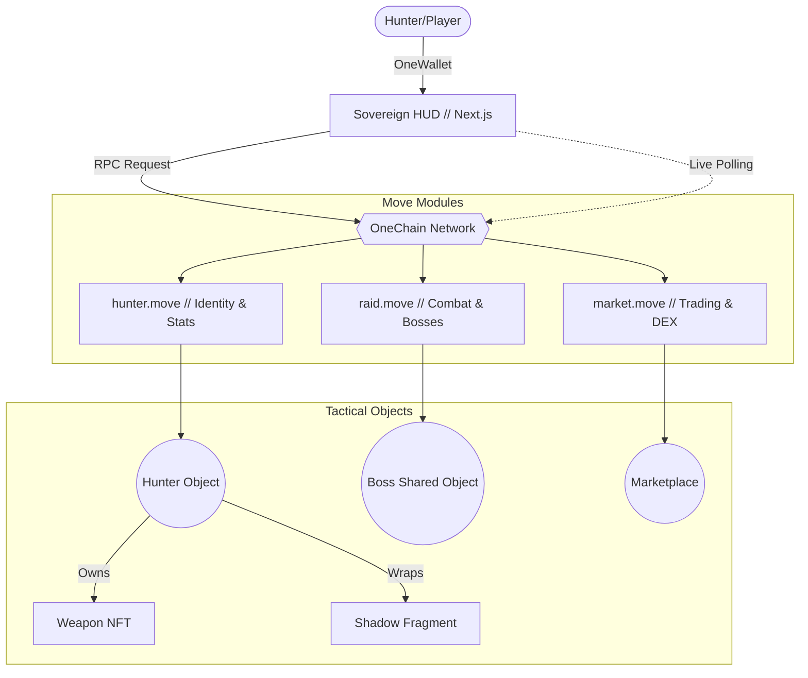
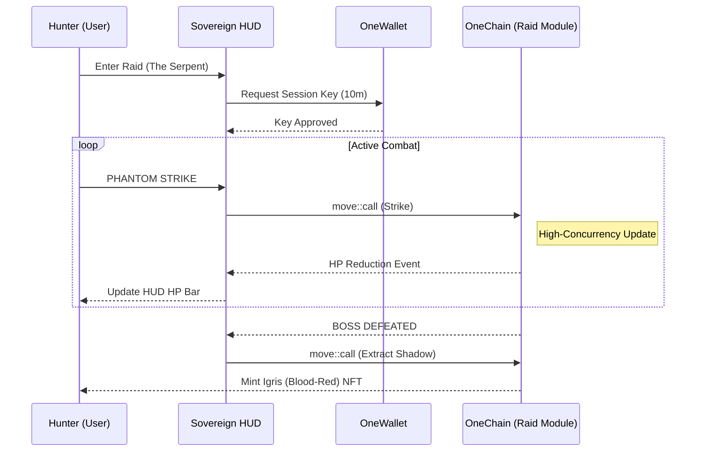

# OneAscension: The Sovereign GameFi Interface

**OneAscension** is a high-concurrency, class-based RPG built on **OneChain**. Inspired by the "Solo Leveling" narrative, the entire game logic—stats, leveling, and raiding—is executed as verified on-chain state transitions.

> [!IMPORTANT]
> **Strict On-Chain Compliance**: Zero simulations or mockups. Every gameplay action (Phantom Strike, Awakening, Extraction) is a real transaction on the OneChain network.

---

## 🏛️ System Architecture

The following diagram illustrates the tactical relationship between the 'Sovereign' frontend and the OneChain Move modules.



---

## ⚔️ Combat Relay Sequence (Session Keys)

OneAscension utilizes **Session Keys** (via OneWallet) to ensure a zero-latency "Invisible Blockchain" experience during active raids.



---

## 💎 OneChain Deployment Metadata

| Component | Identifier |
| :--- | :--- |
| **Network** | `https://rpc-testnet.onelabs.cc` (Testnet) |
| **Package ID** | `0x373cb407e67f419841e5af4827abb5d0ed6a9a8ad5e63fcce12f097737f02ca2` |
| **Leaderboard** | `0x86fbed50087eb1f7308e52480e397c4c023a669d6ca55dbc3ea1cb544971979d` |
| **Boss Instance** | `0x52ab308ed19ca586f810e2274350aea3f9893ae44decb4e897c304c7c1f1f862` |

---

## 🛠️ Key Technical Features

- **OneWallet Session Keys**: 0s confirmation popups during active gameplay.
- **OneID Persistence**: Player rank (E-Rank) and reputation survive across all ecosystem nodes.
- **Object-Centric Composability**: Weapons and Shadows are physically nested within the Hunter object.
- **Sovereign Aesthetic**: Brutalist geometry, glassmorphism, and high-contrast tactical HUD.
- **Zero-Error Build**: Verified Next.js 15+ production environment with TypeScript 5.0+ stability.

---

## 🚀 The OneChain Advantage

### 1. Object-Centric Composability (Move)
Unlike other chains that use account-balance models, OneChain uses an **Object-Centric model (Move)**. This is why OneAscension can "wrap" items:
- A **Weapon** is a physical object placed *inside* your **Hunter** object.
- A **Shadow** is a soul *attached* to your identity.
This "nested ownership" makes the game logic significantly more secure and efficient.

### 2. Native Parallelism
On other chains, one busy game can slow down the entire network (the "Gas War" problem). On OneChain, because every Raid is an independent shared object, they are processed in **parallel**. This ensures that even during peak concurrency (thousands of players), skill execution remains sub-second.

### 3. Integrated Economy: The Market Factor
The "Hunter Association" (Shadow Market) is the heart of the game's economy:
- **Scarcity**: Boss shadows are limited-edition NFTs with verifiable mint counts.
- **Velocity**: Enabled by **OneDEX**, the speed of trading creates a vibrant secondary market for crafting materials and "unopened" loot boxes.
- **Interoperability**: Because of **OneTransfer**, your game assets have value *outside* the game, turning your playtime into real-world equity.

---

## 🏁 Conclusion
OneAscension is the sovereign interface for the OneChain era. It transitions gaming from "playing on a database" to "transacting in an ecosystem," where every swing of a sword is a secured state transition on the world's fastest GameFi network.

---

## 🚀 Getting Started

### 1. Installation
```powershell
# Root Directory
npm install
cd frontend
npm install
```

### 2. Deployment (Tutorial)
To reset the tutorial boss encounter to **The Serpent**:
```powershell
npx ts-node scripts/spawn_tutorial_boss.ts
```

### 3. Development
```powershell
cd frontend
npm run dev
```

---
**Transcend the Tower. The System is ready.**
[GitHub: Narayanan-D-05/OneAscension](https://github.com/Narayanan-D-05/OneAscension)
